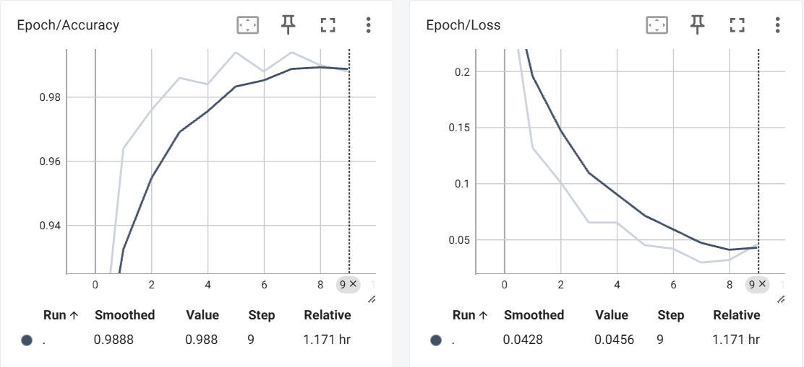

# NASA APP Challenge --- Exoplanet Detection using AI

## Overview

This project provides tools and scripts to download, process, and label exoplanet light curve data from NASA missions (Kepler, TESS), and train deep learning models for exoplanet detection.

**Create a Python virtual environment:**

There is 30 seconds intro video under project videos folder

## Environment Setup

1. **Create a Python virtual environment:**

	 python -m venv your_venv_name

2. **Activate your environment:**
	
	 .\your_venv_name\Scripts\activate

3. **Install dependencies:**

	 pip install -r requirements.txt
	
4. **Install PyTorch and torchvision (CPU version):**
	
	 pip install torch torchvision --index-url https://download.pytorch.org/whl/cpu
	 
	 or go to pytorch website to generate install script for your environment
	*If you try to install pytorch package along with others it will show errors and out. Do not know why
5. **Open streamlit web interface::**

	streamlit run streamlit_main.py

6. **Youtube Videos**

	- [3 minutes video](https://youtu.be/WgQTELl5twk)
    - [30 seconds video](https://youtu.be/gxsNtbIP9C0)

## Data Download

- **Kepler KOI Light Curves:**  
	Use `download_koi_lightcurves_complete.py` to download Kepler KOI light curves.  
	
	python download_koi_lightcurves_complete.py
	
	Data will be saved in the `koi_data/` folder.

- **TESS TOI Light Curves:**  
	Use `download_toi_lightcurves_complete.py` to download TESS TOI light curves.  
	
	python download_toi_lightcurves_complete.py
	
	Data will be saved in the appropriate folder.

## Data Processing

- **Plot Light Curves:**  
	Use `extract_light_curve.py` to process raw light curve files and extract usable data and plot.
## Example Light Curve

## Utilities

- **Integer Conversion for Sorting:**  
    Use `convert_to_int(x)` to convert strings to integers for sorting purposes.

- **Light Curve Plotting:**  
    Use `plot_tbl_mag_vs_bjd(tbl_filepath)` to read a `.tbl` file and plot the magnitude versus BJD (Julian Date), showing both the original and detrended light curves.

- **Label Dictionary Generation:**  
    Use `generate_label_dict_from_toi_csv(filepath)` to create a dictionary mapping HIP IDs to binary labels from a TOI CSV file.  
    Use `generate_label_dict_from_koi_csv(filepath)` to create a dictionary mapping KOI/Kepler names to binary labels from a KOI CSV file.

- **FITS File Copying:**  
    Use `copy_fits_files_from_toi_test_to_data(toi_test_data_folder, toi_data_folder)` to recursively copy `.fits` files from TOI test data folders to a target data directory, organizing by ID.  
    Use `copy_fits_files_from_koi_test_to_data(koi_test_data_folder, koi_data_folder)` to do the same for KOI/Kepler names.

- **First ID Light Curve Plotting:**  
    Use `plot_first_id_fits_in_toi_data(toi_data_folder)` to plot the light curve and FFT spectrum for the first ID folder found in the TOI data directory. We will train the model to leran from the images (KOI Light Curve + FFT).

	

- **JSON Loader:**  
    Use `load_json_to_dict(filepath)` to load a JSON file and return its contents as a Python dictionary.

## Dataset Creation

  **Data files organization**
	Currently we have a koi_data folder(This project uses kepler data only), its subfolder are named by the objects' name in the kois.csv. All the fits files downloaded are put innto the folders accordingly

- **Dataset Preparation:**  
	Use `lightcurvedataset.py`to create PyTorch datasets for training and validation. It loop through the data folder mentioned above, load the fits files and label them based on the fits_labels_dict file.

- **Configuration:**  
	Edit `config.yaml` to set paths, batch size, validation split, and other hyperparameters.

## Model Training

- **Train Model:**  
	Use `train_main.py` to train models on the prepared dataset.
	
	python train_main.py
	
	- Models are saved in the `models/` directory.
	- Training logs and TensorBoard summaries are saved in the `exoplanet_YYYYMMDD_HHMMSS/` folders.

- **Model Architectures:**  
	- `exoplanet.py` and `exoplanetresnet.py` contain model definitions.

	Accuracy and Loss curve
	

## Evaluation

- **Load Best Model:**  
	Use the `load_best_model` function in `train_main.py` to load the best checkpoint based on validation accuracy.
	Use the `load_model_from_folder` function in `train_main.py` to load the specified model.
- **Testing:**  
	predict.py will run test and output confusion matrix

	Confusion Matrix
	

## Visualization

- **TensorBoard:**  
	To visualize training progress:
	
	tensorboard --logdir=./logs/exoplanet_2025_1
	
# How To Prepare and Organize the Dataset

## 1. Organize Data Files
- Create a `koi_data/` folder in your project directory.  
- Inside `koi_data/`, create a subfolder for each object listed in `kois.csv`.  
- Place all downloaded `.fits` files into their corresponding subfolders.There is a utility function can help you create subfolder and move the files into it fromfresh dowloaded fits files.

## 2. Prepare the Dataset
- Run the `lightcurvedataset.py` script to generate training and validation datasets.  
- The script will:
  - Iterate through the `koi_data/` folder  
  - Load `.fits` files from each subfolder  
  - Assign labels to files using the `fits_labels_dict`file 

## 3. Configure Dataset Parameters
- Edit `config.yaml` to define dataset and training settings, including:  
  - Data paths  
  - Batch size  
  - Validation split ratio  
  - Other hyperparameters relevant to your training  

## Summary
1. Organize `.fits` files in the `koi_data/` directory.  
2. Use `lightcurvedataset.py` to process and label the data.  
3. Adjust `config.yaml` for proper dataset and training configuration.  

## Additional Notes

- All scripts are designed to be run from the project root.
- For GPU support, install the appropriate PyTorch version for your hardware.
